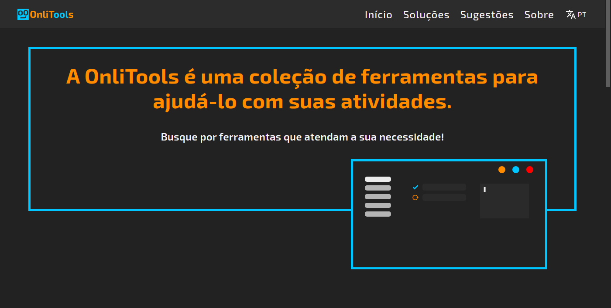

<h1>Oi! Eu sou o Lucas! 👋</h1>

## 1. Sobre

### 1.1 Bio

Bem vindo(a), ao meu perfil! Eu sou um estudante de Engenharia de Software, desenvolvedor Front-end na(o) (...) e apaixonado por aprender novas tecnologias. Natural de Canindé (CE), atualmente em Quixadá (CE). No momento, estou focado em React JS, Next JS, Chakra UI e UX - que estou usando no meu projeto pessoal **[confira aqui: <a href="https://www.onlitools.com/" target="_blank">OnliTools</a>]** - mas você pode conferir minhas [outras stacks e tecnologias](#3-tecnologias). Role a página e conheça um pouco mais sobre mim!

### 1.2 Educação

1. Técnico em Rede de Computadores, **EEEP José Vidal Alves**.
2. Estudante de Engenharia de Software (3º sem.), **Universidade Federal do Ceará**.
3. ...

### 1.3 Redes Sociais e Contato

  
  
  
  

### 1.4 Projeto Principal

A OnliTools é um site de ferramentas que visa ajudar pessoas em suas tarefas diárias, conheça as <a href="https://github.com/LucasLevyOB/onlitools_public" target="_blank">tecnologias usadas</a> ou faça uma visita ao <a href="https://www.onlitools.com/" target="_blank">site</a>.

  

### 1.5 Estatísticas no GitHub

  
  

## 2. Repositórios

### 2.1 Front-end

  <b>Clones</b>
  

    
    
  

  <b>Projetos</b>
  

    
    
    
  

### 2.2 Back-end

  <b>API Rest</b>
  

    
  

### 2.3 Full Stack

  <b>Team</b>
  

    
  

### 2.4 Estudo

  <b>Java</b>
  

    
    
  

## 3. Tecnologias

Tecnologias com as quais tive contato.

### 3.1 Linguagens de Programação

  
  
  
  

### 3.2 Frameworks

  
  
  
  
  
  

### 3.3 Bibliotecas

  
  
  
  

### 3.4 Outras

  
  
  
  
  
  

  
  
  
  
  
  

  
  
  

